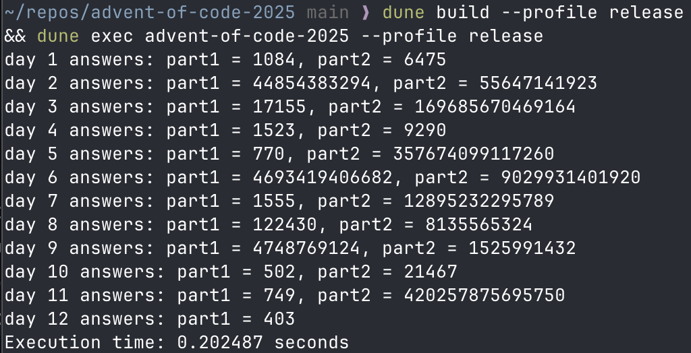

# advent-of-code-2025
My solutions (using OCaml for the first time!) to Advent of Code 2025!

# Running
To run all days and parts, simply run `dune build --profile release && dune exec advent-of-code-2025 --profile release` from the project root. This takes around 200ms on my M2 MacBook Air (single-threaded).
